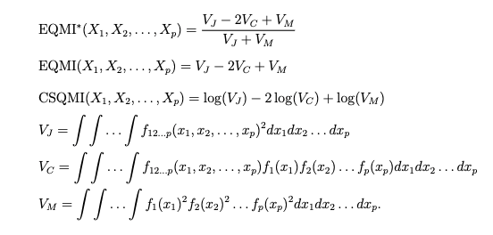

```{r setup, include=FALSE}
knitr::opts_chunk$set(
  collapse = TRUE,
  comment = "#",
  out.width = "100%",
  messages = FALSE,
  warnings = FALSE
)
```

This is an R package implementing the proposed method from the paper, "MIAMI: Mutual Information-based Analysis of Multiplex Imaging data". The package provides a thorough pipeline for performing marker co-expression analysis of multiplex imaging data, such as Vectra (Huang et. al. 2013) and MIBI data (Keren et. al. 2019). The package also provides standalone functions for computing several mutual information (MI) theoretic measures (Principe 2010), such as EQMI*, EQMI and CSQMI for quantifying the dependence between random variables in general datasets (definitions are available below in the appendix).

## Loading the package

We install and load the developmental version of MIAMI from GitHub.

```{r loading packages, message=FALSE}

suppressMessages(devtools::install_github('sealx017/MIAMI'))
require(MIAMI)

```

## Loading the example datasets

Next, we import the example files named, "Marker_Data.csv" and "Clinical_Data.csv". The first one has expression data of five markers ($p$ = 5), HLA-DR, CD45RO, H3K27me3, H3K9ac and HLA_Class_1 for 39 subjects. The second one has data of two clinical outcomes, recurrence and survival and one covariate, Age for the same set of subjects. Both of these files are extracted from the triple-negative breast cancer MIBI data first published in Keren et. al. 2018. The files have a common column named "ID" denoting subject IDs.

```{r loading the marker expression, out.width = "50%"}

data("marker_data")
knitr::kable(head(marker_data), format="markdown")

```

```{r loading the clinical data, echo = T, results = T}

data("clinical_data")
knitr::kable(head(clinical_data), format="markdown")

```

## Compute EQMI\*, EQMI and CSQMI with an arbitrary data matrix

* We start by showing how to compute the MI-based measures, EQMI\*, EQMI, and CSQMI (Principe 2010) between any arbitrary set of random variables (r.v.'s) from a general data-frame i.e., when the data does not necessarily come from multiplex imaging platforms. We create a matrix named Data_matrix with 2500 samples and 5 columns corresponding to five r.v.'s and use it in the function named QMI to estimate the measures.


* A novelty of the estimation algorithm is that the quantities are computed in a step-wise fashion. It means that along with the EQMI\* between the full set of markers, one can easily extract the EQMI\* between several smaller sets of markers. For example, with $p$ = 5 markers, (1, 2, 3, 4, 5), the EQMI\* between all the following sets of markers can be extracted in a single estimation procedure,
    + (1, 2), denoted by EQMI*_12
    + (1, 2, 3), denoted by EQMI*_123
    + (1, 2, 3, 4), denoted by EQMI*_1234
    + (1, 2, 3, 4, 5), denoted by EQMI*_12345.

* The estimation algorithm requires selecting bandwidth parameters for each of the r.v.'s. the default option, bandwidth = "Hpi" uses the multivariate plug-in bandwidth matrix described in Wand, M. P., & Jones, M. C. (1994). However, in larger datasets (especially, for large $p$) for faster computation, bandwidth = "Ind", which chooses bandwidth by Silverman's rule (Silverman, B.W. (2018)) for every r.v., can be used. 


```{r Computing EQMI*, EQMI and CSQMI with an arbitrary data matrix, echo = T, results = T}

Data_matrix = marker_data[1:2500, -1]
QMIs = QMI(Data_matrix, bandwidth = "HPI", measure = "All", var_names = T)
print(QMIs)

```

## Computing subject specific EQMI* values with the imaging data

We return to the analysis of multiplex imaging data. We compute the EQMI\* of all the subjects using the function QMI_all and store the values in a matrix whose every row corresponds to a subject. 

```{r EQMI_star_computation}

EQMI_vector = QMI_all(marker_data, bandwidth = "Ind", measure = "EQMI_star", progress_bar = "False")
knitr::kable(head(EQMI_vector), format="markdown")

```

## Association testing using CoxPH model

### Association testing with survival outcome

Using the vector of estimated EQMI\* of all the subjects, we perform association analysis with two clinical outcomes, survival and recurrence. We have the outcomes, the time to death and the time to recurrence and the respective censoring indicators (= 0 for an event) as the columns of the matrix named clinical_data. We have one single covariate, Age in the same matrix. Below, we create a matrix named surv_dat with all the subject IDs and their survival outcomes, and another matrix named covariates with the subject IDs and available covariates which, in this case, is just Age. We then use the function Cox_PH to fit the proportional hazard (PH) model outputting a table of p-values. To add higher order terms in the PH model, change degree to > 1. 

```{r CoxPh model studying association between EQMI and survival}

surv_dat = clinical_data[,c(1,4:5)]
covariates = clinical_data[,c(1,6)]
SurvCox = Cox_PH(surv_dat, covariates, EQMI_vector, degree = 1)
knitr::kable(SurvCox, format="markdown")

```

### Association testing with recurrence outcome

Below, we create a matrix named recur_dat with all the subject IDs and their recurrence outcomes, and use the same covariates matrix as earlier. We again use the Cox_PH function and get the p-values.

```{r CoxPh model studying association between EQMI and recurrence}

recur_dat = clinical_data[,c(1:3)]
RecurCox = Cox_PH(recur_dat, covariates, EQMI_vector, degree = 1)
knitr::kable(RecurCox, format="markdown")

```

## Additional tools: Compute and plot univariate and bivariate kernel densities of the markers

#### Univariate marginal density

We provide a few basic functions to estimate and plot the univariate marginal densities of the random variables. We go back to the matrix named Data_matrix which has 2500 samples and 5 columns corresponding to five r.v.'s. We look at first two columns (call them, X_1 and X_2) and estimate their kernel density estimates as f_1 and f_2 using the function dens_univ. Next, using the function univ_dens_plot, we plot f_1 and f_2. The default number of grids is, ngrids = 1024 and the bandwidth parameter is selected using Silverman's rule.

```{r Computing univ density, fig.show = "hold", out.width = "50%"}

X_1 = Data_matrix[,1]
X_2 = Data_matrix[,2]  

f_1 = univ_dens(X_1, ngrids = 1024)
f_2 = univ_dens(X_2, ngrids = 1024)

p1 = univ_dens_plot(f_1)
p2 = univ_dens_plot(f_2)

```

#### Bivariate joint density

We estimate the bivariate joint density of X_1 and X_2, as f_12 using the function biv_dens. Next, using the function biv_dens_plot, we plot f_12. The default number of grids is, ngrids = 512 and the bandwidth matrix used is the multivariate plug-in bandwidth matrix described in Wand, M. P., & Jones, M. C. (1994). It may be easy to interpret the estimated density focusing only on the smaller values of $X_1$ and $X_2$ since both the r.v.'s usually have most of the values close to 0. Hence, we use two thresholds (q1, q2) to display the estimated density only between 70\% quantiles of both the r.v.'s. 

```{r Computing biv density}


f_12 = biv_dens(cbind(X_1, X_2), ngrids = 512)
q1 = quantile(X_1, 0.7); q2 = quantile(X_2, 0.7)
p = biv_dens_plot(f_12, maxs = c(q1, q2))


```


## References

a\) Huang, W., Hennrick, K., & Drew, S. (2013). A colorful future of quantitative pathology: validation of Vectra technology using chromogenic multiplexed immunohistochemistry and prostate tissue microarrays. Human pathology, 44(1), 29-38.

b\) Keren, L., Bosse, M., Thompson, S., Risom, T., Vijayaragavan, K., McCaffrey, E., ... & Angelo, M. (2019). MIBI-TOF: A multiplexed imaging platform relates cellular phenotypes and tissue structure. Science advances, 5(10), eaax5851.

c\) Principe, J. C. (2010). Information theoretic learning: Renyi's entropy and kernel perspectives. Springer Science & Business Media.

d\) Keren, L., Bosse, M., Marquez, D., Angoshtari, R., Jain, S., Varma, S., ... & Angelo, M. (2018). A structured tumor-immune microenvironment in triple negative breast cancer revealed by multiplexed ion beam imaging. Cell, 174(6), 1373-1387.

e\) Wand, M. P., & Jones, M. C. (1994). Multivariate plug-in bandwidth selection. Computational Statistics, 9(2), 97-116.

f\) Silverman, B. W. (2018). Density estimation for statistics and data analysis. Routledge.

## Appendix

### Definition of the measures

Here, we show the mathematical definitions of the three different MI-based measures, EQMI*, EQMI and CSQMI, implemented in this package. 



$f_{12 \ldots p}(x_{1}, x_{2}, \ldots , x_{p})$ is the joint PDF and $f_{1}(x_{1}), f_{2}(x_{2}), \ldots f_{p}(x_{p})$ are the marginal PDFs of the $p$ variables. The details of the efficient algorithm used for estimating $V_J, V_C$ and $V_M$ can be found in the manuscript, "MIAMI: Mutual Information-based Analysis of Multiplex Imaging data". 
